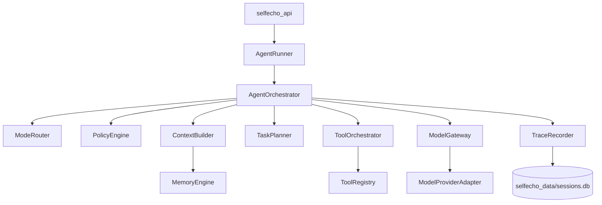
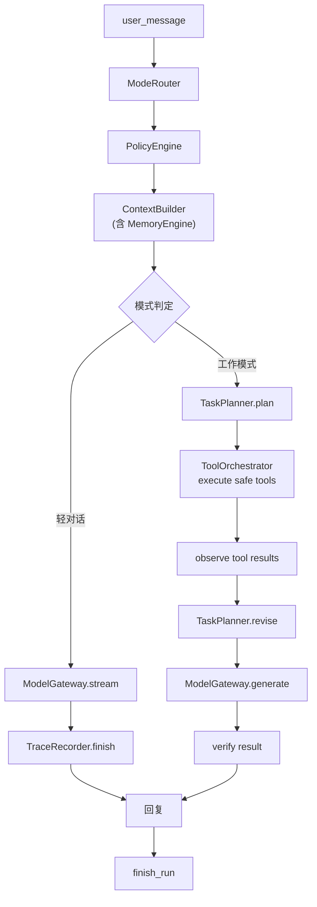

# 智能体 Harness 架构

IwIw 的智能体模块负责把用户请求推进成可追踪、可恢复、可验证的运行过程。它不是单次 prompt 包装层，而是本地个人智能体的执行 harness。

目标形态接近 Claude Code、Codex、opencode、Trae 这类 agent：能理解目标、组装上下文、规划步骤、调用工具、观察结果、恢复错误，并在风险动作前停下来等用户确认。

当前 `selfecho_agent` 代码只能视为早期 tracer bullet。它证明了 API、上下文、工具、模型和 trace 可以串起来，但不能作为成熟 harness 的目标形态继续堆功能。

## 目标

- 让 `selfecho_agent` 拥有独立解决问题的运行闭环。
- 让模型调用成为可配置、可流式、可重试、可追踪的深 Module。
- 让工具执行经过统一 registry、权限策略、风险分级和审计。
- 让每次运行都能回放：输入、上下文、计划、工具结果、模型调用、错误和最终状态。
- 让 API 和 GUI 只依赖一个 agent-facing Interface，不理解内部规划、工具、模型或 trace 细节。

## 现状评估

早期项目应优先清掉错误结构，不把临时实现固化成长期债务。当前 `selfecho_agent` 代码只能视为 tracer bullet，绝大部分现有实现需要重写而非扩展。

第一轮重构以替换 `ModelGateway`、`ContextBuilder`、`AgentOrchestrator` 和工具权限契约为最高优先级。外部 seam（`AgentRunner` 入口、trace 概念、工具注册概念）可保留。

## 核心形态



## Module 职责

| Module | 责任 |
|---|---|
| `AgentRunner` | API-facing Adapter，只暴露普通回复和流式回复 |
| `AgentOrchestrator` | 本轮运行主控，串联路由、策略、上下文、计划、工具、模型和 trace |
| `ModeRouter` | 判断本轮是陪伴对话、工作处理、记忆维护、风险反思或澄清。依据：用户消息中的明确意图信号 + 最近上下文的主题连续性 + 用户显式模式切换。轻对话和陪伴模式走快速路径，不进入多轮工具循环 |
| `PolicyEngine` | 评估权限、风险、确认点、回滚要求和恢复建议 |
| `ContextBuilder` | 组装 agent prompt 所需上下文，调用记忆层 Interface，不直连底层存储 |
| `TaskPlanner` | 把用户目标变成可执行计划，并在观察结果后更新计划 |
| `ToolRegistry` | 注册工具的名称、描述、参数、权限和风险等级 |
| `ToolOrchestrator` | 执行工具计划，返回结构化观察结果和错误恢复信息 |
| `ModelGateway` | 统一模型调用，处理 provider、流式、超时、重试、结构化输出和 trace |
| `TraceRecorder` | 持久化 run、step、event、timeline 和错误 |
| `HarnessEvaluator` | 不调用模型的 harness 结构测试，以及可选端到端 smoke test |

`AgentOrchestrator` 是核心深 Module。调用方只需要提交 `AgentRequest`，不需要知道内部用哪个 provider、哪些工具、几轮规划或怎样恢复错误。现有同名实现不应继续扩展，应按本文 Interface 重写。

## Agent-facing Interface

`selfecho_api` 和 GUI 只调用 `AgentRunner`。

```python
AgentRunner.respond(session_id: str, message: str) -> AgentResponse
AgentRunner.respond_stream(session_id: str, message: str) -> AsyncIterator[AgentStreamEvent]
```

`AgentRunner` 内部只转发给 `AgentOrchestrator`，不包含模式判断、模型调用、工具执行或记忆拼装逻辑。

```python
AgentOrchestrator.run(request: AgentRequest) -> AgentResult
AgentOrchestrator.run_stream(request: AgentRequest) -> AsyncIterator[AgentStreamEvent]
```

`AgentRequest` 应逐步扩展为：

```python
AgentRequest(
    session_id: str,
    message: str,
    project_id: str | None,
    user_intent_hint: str | None,
    permission_profile: PermissionProfile,
    client_capabilities: dict,
)
```

`AgentResult` 必须包含：

```python
AgentResult(
    answer: str,
    status: "completed" | "degraded" | "blocked" | "failed" | "cancelled",
    run_id: str,
    trace: dict,
    artifacts: list[ArtifactRef],
)
```

## 运行闭环



轻对话只走一次模型调用，不进入多轮工具循环。工作模式进入 plan / act / observe / repair 闭环。

每个 run 都有预算：

- 最大模型调用次数。
- 最大工具轮数。
- 最大运行时间。
- 最大上下文 token。
- 最大连续失败次数。

预算耗尽时状态为 `blocked` 或 `degraded`，并把已完成内容、失败原因和下一步选择交给用户。

## 大模型调用 Module

`ModelGateway` 是模型调用的唯一 Interface。它不暴露 provider 细节给 orchestrator。

```python
ModelGateway.generate(request: ModelRequest) -> ModelResult
ModelGateway.stream(request: ModelRequest) -> AsyncIterator[ModelStreamEvent]
```

`ModelRequest`：

```python
ModelRequest(
    role: str,
    messages: list[ModelMessage],
    temperature: float,
    max_tokens: int,
    timeout_s: float,
    response_format: ResponseFormat | None,
    trace_id: str,
)
```

`ModelResult`：

```python
ModelResult(
    text: str,
    finish_reason: str,
    provider_id: str,
    model: str,
    usage: TokenUsage,
    latency_ms: int,
    retry_count: int,
    raw_error: str | None,
)
```

模型调用必须支持：

- 普通完成和流式输出；只在首 token 输出前允许回退到单次完成，已输出部分后失败不得重试整段回答。
- role → 默认模型映射，超时与自动重试。
- 结构化输出：JSON schema 或 typed parser。
- token 估算与上下文预算报告。
- 调用 trace（provider / model / role / 耗时 / token / 重试 / 错误摘要）与 cancellation。

错误不应被吞掉。模型不可用时，run 进入 `degraded` 或 `failed`，并给出可恢复信息。

`ModelGateway` 位于 `selfecho_model`，不依赖 `memory_agent`。记忆整理和 agent 复用同一模型调用 Interface，provider HTTP 细节由同包的 `ProviderAdapter` 承担。

## Provider Adapter

Provider 是 `ModelGateway` 内部 Adapter。

```python
ModelProviderAdapter.complete(request: ProviderRequest) -> ProviderResult
ModelProviderAdapter.stream(request: ProviderRequest) -> AsyncIterator[ProviderStreamEvent]
ModelProviderAdapter.health_check() -> ProviderHealth
```

当前产品只需要按 active provider 调用，不做多 provider 自动路由。以后如果出现多个 Adapter，`ModelGateway` 仍保持同一个 Interface。

## 上下文组装

`ContextBuilder` 只负责组织本轮 prompt，不负责检索实现、工具执行或模型调用。

上下文顺序：

```text
1. system contract
2. mode policy
3. global tendency profile
4. project tendency profile
5. recalled corpus snippets
6. session recent context
7. workspace/tool observations
8. current plan
```

记忆上下文来自 `MemoryEngine.build_context(...)`。`ContextBuilder` 不直接读 SQL、FTS、向量 chunk 或 tendency profile。

项目目录、工具观察和会话摘要都应作为明确的 context source 注入。`ContextBuilder` 不直接扫描工作目录；工作区观察由工具系统产生，再作为 tool observation 进入上下文。

上下文预算必须产生报告：

- 每段名称。
- 每段估算 token。
- 是否被截断。
- 截断原因。
- 总 token。

## 规划 Module

`TaskPlanner` 负责把用户目标变成执行计划。

```python
TaskPlanner.plan(input: PlanningInput) -> ExecutionPlan
TaskPlanner.revise(input: PlanRevisionInput) -> ExecutionPlan
```

计划必须包含：

- 目标。
- 可执行步骤。
- 需要的工具调用。
- 风险等级。
- 是否需要用户确认。
- 验证方式。
- 停止条件。

确定性 planner 只能作为 fallback。成熟工作路径需要 LLM planner 或 hybrid planner，但 planner 只能产出计划，不直接执行工具。

```python
ExecutionPlan(
    objective: str,
    steps: list[PlanStep],
    risk_level: "low" | "medium" | "high",
    requires_confirmation: bool,
    verify_method: str,
    stop_conditions: list[str],
)

PlanStep(
    index: int,
    description: str,
    tool_name: str | None,
    tool_args: dict | None,
    expected_outcome: str,
    fallback_step_index: int | None,
)
```

## 工具系统

工具只能通过 `ToolRegistry` 注册，通过 `ToolOrchestrator` 执行。

```python
ToolSpec(
    name: str,
    description: str,
    input_schema: dict,
    required_permission: PermissionLevel,
    risk_level: "low" | "medium" | "high",
    handler: ToolHandler,
)
```

```python
ToolResult(
    name: str,
    ok: bool,
    status: str,
    summary: str,
    content: dict,
    artifacts: list[ArtifactRef],
    error: str,
    root_cause_hint: str,
    safe_retry: bool,
    stop_condition: str,
)
```

工具规则：

- 读操作可以自动执行。
- 写文件、删文件、记忆删除、git、网络和 shell 默认高风险。
- 高风险工具必须经过 `PolicyEngine` 和确认 gate。
- 工具结果必须进入 trace。
- 工具失败时返回结构化错误，不让模型猜测结果。
- 工具调用必须有预算，避免无限循环。

## 权限与确认

`PolicyEngine` 输出：

```python
RiskPolicy(
    risk_level: "low" | "medium" | "high",
    requires_confirmation: bool,
    categories: list[str],
    rollback_required: bool,
    allowed_tools: list[str],
    blocked_tools: list[str],
    recovery_steps: list[str],
)
```

确认 gate 的规则：

- 低风险只读观察可以自动执行。
- 中风险动作先展示计划和影响范围。
- 高风险动作必须展示回滚方案或不可回滚说明。
- 用户确认必须绑定具体 action，不用一次确认覆盖后续所有高风险动作。

确认 gate 通过 `AgentResult` 的状态字段与 API 层交互：

```text
AgentOrchestrator 遇到高风险动作
  -> 返回 AgentResult(status="blocked", pending_approval=ApprovalRequest(...))
  -> API 层向 GUI 展示确认 UI
  -> 用户确认 / 拒绝
  -> API 层调用 AgentRunner.resume(run_id, approval=ApprovalResponse(...))
  -> AgentOrchestrator 从断点继续
```

```python
ApprovalRequest(
    run_id: str,
    action_id: str,
    action_description: str,
    risk_level: "medium" | "high",
    affected_paths: list[str],
    rollback_plan: str | None,
    irreversible: bool,
)

ApprovalResponse(
    action_id: str,
    approved: bool,
    user_note: str | None,
)
```

## Trace 与回放

所有运行都写入 `selfecho_data/sessions.db`。

核心记录：

```text
agent_runs
- id
- session_id
- project_id
- status
- mode
- objective
- started_at
- ended_at
- model_role
- permission_profile
- context_budget
- error
- metadata
```

```text
agent_events
- id
- run_id
- event_type
- status
- title
- summary
- details
- created_at
```

```text
agent_timeline
- id
- session_id
- run_id
- kind
- title
- summary
- risk_level
- reversible
- status
- details
- created_at
```

trace 必须能回答：

- agent 为什么这么做。
- 用了哪些上下文。
- 调用了哪些工具。
- 模型是否失败或重试。
- 哪些动作需要用户确认。
- 最后状态为什么是 completed、degraded、blocked 或 failed。

## 错误恢复

Harness 必须显式处理以下错误：

- 模型超时、限流、配置缺失、流式中断。
- 工具不存在、参数不合法、权限不足。
- 文件或目录不可读。
- 上下文超预算。
- 计划执行后没有进展。
- 用户取消运行。

恢复策略：

- 可安全重试时自动重试一次。
- 流式首 token 前失败时回退到单次完成；已有输出时保留 partial response，不生成重复回答。
- 客户端取消时 run 和当前 step 进入 `cancelled`；已发送的 assistant partial response 按 cancelled 状态写入会话并关联 run trace。
- 工具失败时把错误观察交给 planner 修正计划。
- 上下文超预算时压缩低价值段，并保留 trace。
- 高风险或无法确认的动作进入 `blocked`，等待用户。

## 与记忆系统的关系

记忆系统回答“应该带入哪些长期上下文”。智能体 harness 回答“拿到上下文后怎样解决问题”。

主链路：

```text
AgentOrchestrator
  -> ContextBuilder
  -> MemoryEngine.build_context
  -> TaskPlanner
  -> ToolOrchestrator
  -> ModelGateway
  -> TraceRecorder
```

工具观察、用户纠正和项目决策可以作为 `MemoryEvent` 进入记忆系统，但写入仍由记忆层自己的 Interface 决定。

## 实施顺序

1. 固化新的 `AgentRequest`、`AgentResult`、`AgentStreamEvent` 契约，保持 `AgentRunner` 外部入口稳定。
2. 将模型运行时从 `memory_agent.llm` 中拆出，建立独立 `ModelGateway` 和 provider adapter。
3. 重写 `ContextBuilder`：只编排 context source，不直接检索记忆、不扫描工作目录。
4. 让 `ContextBuilder` 只通过 `MemoryEngine.build_context(...)` 获取记忆上下文。
5. 重写 `ToolSpec` / `ToolResult`：加入 input schema、权限、风险、artifact、async 和 cancellation。
6. 建立确认 gate：中高风险动作返回 `waiting_approval`，不直接执行。
7. 重写 `AgentOrchestrator` 为工作模式多轮 loop：plan / act / observe / repair / verify。
8. 扩展 trace schema，覆盖模型调用、工具审批、预算、artifacts、错误恢复和状态转移。
9. 清理被替换的关键词 planner、旧 context 拼装和跨模块模型调用依赖。
10. 为 harness 增加 contract tests、无模型 eval 和少量真实链路 smoke test。
