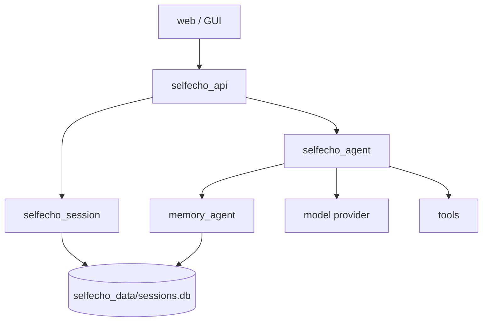

# IwIw 系统设计架构

IwIw 是一个记忆驱动的本地个人智能体。当前架构重点是记忆系统和智能体 harness 重构：先把原始材料可靠保存，再让 agent 能基于上下文、工具、模型调用和 trace 独立推进问题。

本文是项目总览。记忆系统细节以 [记忆系统架构](memory-system-architecture.md) 为准；智能体模块细节以 [智能体 Harness 架构](agent-harness-architecture.md) 为准。

## 核心形态



## Module 职责

| Module | 责任 |
|---|---|
| `web/` | 本地 GUI，展示会话、记忆、模型配置、运行状态和审计结果 |
| `selfecho_api/` | 本地 transport adapter，暴露 REST/SSE，连接 GUI 和内部 Module |
| `selfecho_session/` | 会话层，保存项目、会话、原始消息、摘要、搜索和回放 |
| `selfecho_agent/` | agent harness，负责模式识别、上下文组装、计划、工具调用、模型调用和 trace |
| `memory_agent/` | 记忆层，负责全量材料入库、轻量召回、倾向编译、版本和审计 |
| `selfecho_config/` | 本地 prompt、provider 和模型配置 |

API 层是 adapter，不承载记忆检索、倾向编译或 agent 决策策略。`ContextBuilder` 只调用记忆层的 agent-facing interface，不直接理解数据库、向量、FTS 或 profile 编译。

## 智能体 Harness

`selfecho_agent` 的目标是成熟本地 agent harness，而不是单次 prompt 包装层。

目标运行闭环：

```text
user_message
  -> AgentRunner
  -> AgentOrchestrator
  -> ModeRouter
  -> PolicyEngine
  -> ContextBuilder
  -> TaskPlanner
  -> ToolOrchestrator
  -> ModelGateway
  -> TraceRecorder
```

当前 agent 代码只作为 tracer bullet 参考。后续实现优先替换错误底座：独立模型运行时、纯 context source 编排、多轮工作 loop、工具确认 gate、完整 trace 和 cancellation。

## 记忆系统

记忆系统分成两层：

- **全量记忆库**：保存会话消息、工具结果、手动记录和项目事件的原始包装。写入不经过 LLM 裁决，检索依靠向量、关键词、时间和作用域。
- **倾向上下文**：由 LLM 从高信号对话和项目事件中整理 agent 全局倾向、工作目录倾向和当前会话 overlay，形成每轮按继承链注入的短 profile。

全量记忆库不对材料做预先价值判断；是否进入上下文由检索得分、作用域和预算决定。倾向 profile 承担行为默认值，不承担事实归档、事实检索或召回排序。

上下文组装顺序和 agent 回复主链路见 [记忆系统架构](memory-system-architecture.md) 的「上下文组装顺序」和 [智能体 Harness 架构](agent-harness-architecture.md) 的「上下文组装」与「运行闭环」。

## 数据真源

| 数据 | 真源 |
|---|---|
| 会话、消息、摘要 | `selfecho_data/sessions.db` |
| 全量记忆材料 | `selfecho_data/sessions.db` |
| 向量 chunk 和 FTS | `selfecho_data/sessions.db` |
| 倾向观察和 profile | `selfecho_data/sessions.db` |
| 版本和审计 | `selfecho_data/sessions.db` |
| 人工可读导出缓存 | `memory/` |

`memory/` 是人工可读导出缓存，不是写入真源。格式为 Markdown，在全量记忆库或倾向 profile 发生变更时异步刷新；如果索引已更新但导出尚未刷新，检索以数据库索引为准。

## 审计与安全

必须审计的操作：

- 手动编辑全量记忆材料。
- 删除全量记忆材料。
- 合并倾向观察。
- 更新倾向 profile。
- 回滚任意记忆内容。
- 文件写入、删除和高风险工具执行。

破坏性或可见内容变更必须返回：

- `version_id`
- `audit_id`
- `changed_rows`

`changed_rows == 0` 不能展示为成功。

## 当前实施顺序

1. 固化 `MemoryEngine`，让 agent、GUI、API 和 MCP 只依赖一个记忆 interface。
2. 通过 `MemoryEngine.capture_material(...)` 建立全量原始材料写入路径。
3. 模型运行时已迁到 `selfecho_model`，由独立 `ModelGateway` 和 `ProviderAdapter` 同时服务 agent 与记忆整理。
4. 重写 `ContextBuilder`，只编排 context source，并通过 `MemoryEngine.build_context(...)` 获取记忆上下文。
5. 实现三层加权 relevance gate，并把 trace 暴露给 eval。
6. 通过 `MemoryEngine.maintain_tendencies(...)` 建立 agent_global / workspace / session 倾向 profile 编译闭环。
7. 重写工具 registry、权限 profile、确认 gate 和 tool result 契约。
8. 将 `AgentOrchestrator` 重写为 plan / act / observe / repair / verify loop。
9. 同步 GUI、API、prompt 和测试里的记忆与 agent 概念。
10. 收口记忆 mutation interface 和 agent trace schema。
